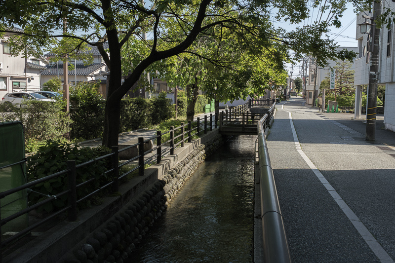

Hdr-Gainmap
=======

Generate HDR images (jpeg + Gain Map) optimized for SDR and HDR displays.

Overview
-----------

This project is a Python tool for generating HDR Gainmap images in JPEG format, with several workflows available:
- Combine an SDR image with a true HDR image
- Combine an SDR image with an underexposed SDR image
- Generate HDR from a tone-mapped SDR image
- Create a pseudo-HDR image from a brighter SDR source

Key features:

- Optimized rendering on both SDR and HDR displays
- Improved brightness, contrast, and visual impact on HDR screens
- Built-in presets for better compatibility with platforms such as Instagram

Quick Start
------------------

```
   git clone https://github.com/jb-jrdn/Hdr-Gainmap
   cd Hdr-Gainmap

   python3 -m venv venv
   source venv/bin/activate    # macOS / Linux
   # venv\Scripts\activate     # Windows PowerShell

   pip install -r requirements.txt
```

Usage
--------

<h3>SDR + native HDR → HDR Gainmap (✅ Recommended)</h3>

Combine SDR image (jpg) and native HDR image (avif)

```
main.py --sdr input_sdr.jpg --hdr input_hdr.avif -o output_uhdr_1.jpg
```

<table>
  <tr>
    <td><b>SDR image</b></br><small>input_sdr.jpg</small></td>
    <td><b>HDR image</b></br><small>input_hdr.avif</small></td>
    <td><b>HDR image with gain map</b></br><small>output_uhdr_1.jpg</small></td>
  </tr>
  <tr>
    <td></td>
    <td></td>
    <td></td>
  </tr>
</table>

<h4>Batch mode:</h4>

```
main.py --dir path/to/images/
```

File naming convention type:

```
image.jpg
image.avif
```

---

<h3>SDR + under-exposed SDR → HDR Gainmap</h3>

Combine SDR image and SDR underexposed image (with EV value)

```
main.py --sdr input_sdr.jpg --sdrev input_sdr_2ev.avif --ev 2 -o output_uhdr_2.jpg
```

<table>
  <tr>
    <td><b>SDR image</b></br><small>input_sdr.jpg</small></td>
    <td><b>SDR image - 2EV</b></br><small>input_sdr_2ev.avif</small></td>
    <td><b>HDR image with gain map</b></br><small>output_uhdr_2.jpg</small></td>
  </tr>
  <tr>
    <td></td>
    <td></td>
    <td></td>
  </tr>
</table>

---

<h3>Tone-mapped SDR → Hdr Gainmap</h3>

Increase brighter part of SDR image to create a HDR version

```
main.py --sdr input_sdr.jpg --ev 2 -o output_uhdr_4.jpg
```

<table>
  <tr>
    <td><b>SDR image</b></br><small>input_sdr.jpg</small></td>
    <td><b>HDR image with gain map</b></br><small>output_uhdr_4.jpg</small></td>
  </tr>
  <tr>
    <td></td>
    <td></td>
  </tr>
</table>

---

<h3>SDR boosted → Hdr Gainmap</h3>

Generate HDR from one SDR image with exposure compensation

```
main.py --sdr input_sdr_2ev.jpg --ev 2 -o output_uhdr_3.jpg
```

<table>
  <tr>
    <td><b>SDR image</b></br><small>input_sdr_2ev.jpg</small></td>
    <td><b>HDR image with gain map</b></br><small>output_uhdr_3.jpg</small></td>
  </tr>
  <tr>
    <td></td>
    <td></td>
  </tr>
</table>

Recommended Lightroom Export Settings
-------------------------------------
- SDR image:
   - HDR Off in Develop mode
   - Export setting:
      - Image Format: JPEG
      - Quality: 95
      - Color Space: Display P3
      - HDR Output: No
- HDR image:
   - HDR On in Develop mode
   - Export setting:
      - Image Format: AVIF
      - Quality: 100
      - Color Space: HDR P3
      - HDR Output: Yes
      - Maximize Compatibility: No

<h3>Note:</h3>

   - SDR and HDR images must have the same image size
   - To use batch mode of this tool, export SDR and HDR in the same folder

📄 License
----------

Apache-2.0 license
